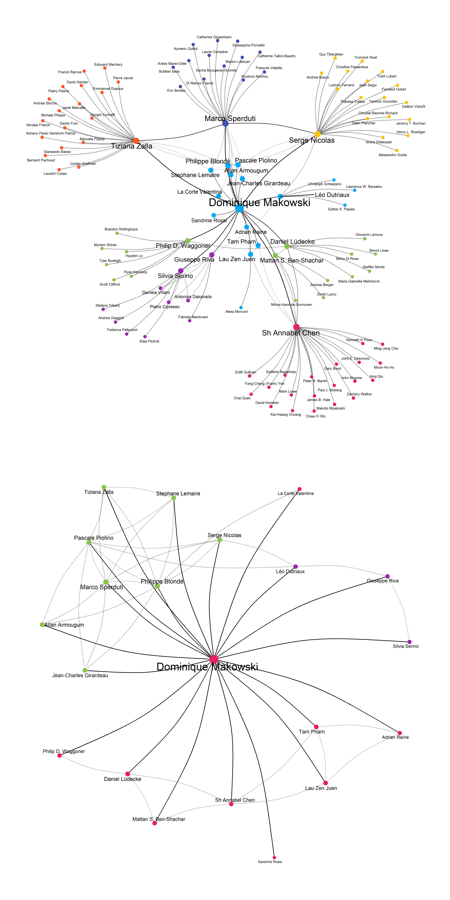

# Publications

  - [**Personal Website**](https://dominiquemakowski.github.io/)
  - [**List of
    Communications**](https://github.com/DominiqueMakowski/publications#communications)

This repo contains materials related to my publications (such as data
and analysis scripts) to facilitate reproducibility and sharing.

## Research

My research wordcloud, based on the most frequent words of my papers
(done using R).

## Scientific Impact *(retrieved on 10 March 2020)*

| Metric                 | Score |
| :--------------------- | ----: |
| Number of Publications |    22 |
| Number of Citations    |   188 |
| h-index                |     8 |
| i10-index              |     8 |

Cumulative citations and publication number, automatically scrapped from
Google Scholar:

## Collaboration Network

The data is retrieved from the Google Scholar co-author list, thus not
100% accurate (e.g., co-authors without a scholar profile are not
listed).

## Communications

### Publications

*2019*

**Makowski, D.**, Sperduti, M., Lavallée, S., Nicolas, S., & Piolino, P.
(2019). [Adaptation and Validation of a Short French Version of the
Affective Style
Questionnaire](https://dominiquemakowski.github.io/publication/makowski2019heart/makowski2019adaptation.pdf).
*International Journal of Cognitive Therapy*, 1-13.

**Makowski, D.**, Ben-Shachar, M. S., Chen, S. H., & Lüdecke, D. (2019).
[Indices of Effect Existence and Significance in the Bayesian
Framework](https://dominiquemakowski.github.io/publication/makowski2019heart/makowski2019indices.pdf).
*Frontiers in Psychology, 10*, 2767.

**Makowski, D.**, Sperduti, M., Blondé, P., Nicolas, S., & Piolino, P.
(2019). [The heart of cognitive control: Cardiac phase modulates
processing speed and
inhibition](https://dominiquemakowski.github.io/publication/makowski2019heart/makowski2019heart.pdf).
*Psychophysiology*, e13490.

**Makowski, D.**, Ben-Shachar, M., & Lüdecke, D. (2019). [bayestestR:
Describing effects and their uncertainty, existence and significance
within the Bayesian
framework](https://dominiquemakowski.github.io/publication/makowski2019bayestestr/makowski2019bayestestr.pdf).
*Journal of Open Source Software*, 4(40), 1541.

Lüdecke, D., Waggoner, P., & **Makowski, D.** (2019). [insight: A
unified interface to access information from model objects in
R](https://dominiquemakowski.github.io/publication/ludecke2019insight/ludecke2019insight.pdf).
*Journal of Open Source Software*, 4(38), 1412.

**Makowski, D.**, Sperduti, M., Pelletier, J., Blondé, P., La Corte, V.,
Arcangeli, M., Zalla, T., Lemaire, S., Dokic, J., Nicolas, S., &
Piolino, P. (2019). [Phenomenal, Bodily and Brain Correlates of
Fictional Reappraisal as an Implicit Emotion Regulation
Strategy](https://dominiquemakowski.github.io/publication/makowski2019phenomenal/makowski2019phenomenal.pdf).
*Cognitive, Affective, & Behavioral Neuroscience*, 19(4), 1-21.

**Makowski, D.**\*, Sperduti, M.\*, Lavallée, S., Nicolas, S. & Piolino,
P. (2019). [Dispositional mindfulness attenuates the emotional
attentional
blink](https://dominiquemakowski.github.io/publication/makowski2019dispositional/makowski2019dispositional.pdf).
*Consciousness & Cognition*, 67, 16–25.

*2018*

**Makowski, D** (2018). [The psycho Package: An Efficient and
Publishing-Oriented Workflow for Psychological
Science](https://dominiquemakowski.github.io/publication/makowski2018psycho/makowski2018psycho.pdf).
*Journal of Open Source Software*, 3(22), 470.

*2017*

**Makowski, D.**, Dutriaux, L. (2017). [Neuropsydia.py: A Python Module
for Creating Experiments, Tasks and
Questionnaires](https://dominiquemakowski.github.io/publication/makowski2017neuropsydia/makowski2017neuropsydia.pdf),
*Journal of Open Source Software*, 2(19), 259.

Tuena, C., Serino, S., Gaston-Bellegarde, A., Orriols, E., **Makowski,
D.**, Riva, G. & Piolino, P. (2017). [How Virtual Embodiment Affects
Episodic Memory Functioning: a Proof-of-Concept
Study](https://dominiquemakowski.github.io/publication/tuena2017virtual/tuena2017virtual.pdf),
*Annual Review of Cybertherapy and Telemedicine*, 15, 93-107.

Sperduti, M., Armougum, A., **Makowski, D.** & Piolino, P. (2017).
[Interaction between attentional systems and episodic memory encoding:
the impact of conflict on binding of
information](https://dominiquemakowski.github.io/publication/sperduti2017interaction/sperduti2017interaction.pdf),
*Experimental Brain Research*, 235(12), 3553-3560.

**Makowski, D.**\*, Sperduti, M.\*, Nicolas, S. & Piolino, P. (2017).
[“*Being there*” and remembering it: Presence improves Memory
Encoding](https://dominiquemakowski.github.io/publication/makowski2017being/makowski2017being.pdf).
*Consciousness & Cognition*, 53, 194–202.

Nicolas, S., & **Makowski, D**. (2017). [Centenaire Ribot (I). La
réception de l’oeuvre de Théodule Ribot chez l’éditeur Ladrange
(1870-1873)](https://dominiquemakowski.github.io/publication/nicolas2017centenaire/nicolas2017centenaire.pdf).
*Bulletin de Psychologie*, 70(3), 163-178.

Sperduti, M., **Makowski, D.**, Blondé, P. & Piolino, P. (2017).
[Méditer pour bien vieillir ? Les possibles bienfaits des pratiques
méditatives sur le déclin cognitif lié à l’âge | Meditation and
successful aging: can meditative practices counteract age-related
cognitive
decline?](https://dominiquemakowski.github.io/publication/sperduti2017meditation/sperduti2017meditation.pdf),
*Gériatrie et Psychologie Neuropsychiatrie du Vieillissement*, 15(2),
205-13.

Sperduti, M.\*, **Makowski, D.**\*, Arcangeli, M., Wantzen, P., Zalla,
T., Lemaire, S., Dokic, J., Pelletier, J. & Piolino, P. (2017). [The
Distinctive Role of Executive Functions in Implicit Emotion
Regulation](https://dominiquemakowski.github.io/publication/sperduti2017distinctive/sperduti2017distinctive.pdf).
*Acta Psychologica*, 173, 13-20.

*2016*

Nicolas, S., & **Makowski, D**. (2016). [Can mental fatigue be measured
by Weber’s compass? Alfred Binet’s answer on the value of aesthesiometry
(tactile sensitivity) as an objective measure of mental
fatigue](https://dominiquemakowski.github.io/publication/nicolas2016can/nicolas2016can.pdf).
*European Yearbook of the History of Psychology*, 2, 11-46.

Sperduti, M., **Makowski, D.**, & Piolino, P. (2016). [The protective
role of long-term meditation on the decline of the executive component
of attention in aging: a preliminary cross-sectional
study](https://dominiquemakowski.github.io/publication/sperduti2016protective/sperduti2016protective.pdf).
*Aging, Neuropsychology, and Cognition*, 23(6), 691-702.

Sperduti, M.\*, Arcangeli, M.\*, **Makowski, D.**, Wantzen, P., Zalla,
T., Lemaire, S., Dokic, J., Pelletier, J. & Piolino, P. (2016). [The
paradox of fiction: Emotional response toward fiction and the modulatory
role of
self-relevance](https://dominiquemakowski.github.io/publication/sperduti2016paradox/sperduti2016paradox.pdf).
*Acta psychologica*, 165, 53-59.

*2015*

**Makowski, D.**, Sperduti, M., Blanchet, S., Nicolas, S. & Piolino, P.
(2015). [Régulation Emotionnelle face au Déclin Cognitif dans le
Vieillissement : Un Faux Paradoxe ? | Emotion regulation and the
cognitive decline in aging: beyond the
paradox](https://dominiquemakowski.github.io/publication/makowski2015emotion/makowski2015emotion.pdf).
*Gériatrie et Psychologie Neuropsychiatrie du Vieillissement*, 13(3),
301-8.

*Note: Electronic versions are provided to ensure timely
dissemination of academic work. They can be downloaded for noncommercial
purposes. Copyright resides with the respective copyright holders as
stated in each article. The files may not be reposted without permission
from copyright holders.*

*Disclaimer: This page is for personal friends only so people that
will download the papers are my peers and friends. As a consequence, the
papers are not shared with strangers.*

### General Audience / Media Coverage

  - Pint of Science, [“Back to the Matrix : pilule bleue ou rouge
    ?”](https://pintofscience.fr/event/back-to-the-matrix--pilule-bleue-ou-rouge-).
    16 May 2018, Paris, France.
  - Public Debate, [*Art & science discussion on sensory
    illusions*](http://www.facts-bordeaux.fr/FESTIVAL/Programme/Agenda-2017/Rencards-du-savoir-Les-illusions-sensorielles).
    24 November 2017, Bordeaux, France.
  - Magazine, [*Neuroanatomie de la réalité : quand le réel n’est
    plus*](https://biblineuropsy.com/2016/04/19/les-yeux-brouilles/).
    2016, Les yeux brouillés, 1, 48-55.
  - National TV, [*The effect of violent images on the brain and
    body*](https://www.youtube.com/watch?v=ihGs1V9kz4w). 2015, Testé
    sous contrôle médical, France 4
  - Online journal, [*”Avengers, l’ère d’Ultron” en 3D : aussitôt vu,
    aussitôt oublié
    ?*](http://blog.francetvinfo.fr/actu-cine/2015/05/07/avengers-lere-dultron-en-3d-aussitot-vu-aussitot-oublie.html)
    2015, francetvinfos.fr

### Talks

*2018*

**Makowski, D.**, Sperduti, M., Nicolas, S. & Piolino, P. (2017).
*Interindividual Determinants of Emotion Regulation through Fiction*.
2ème Congrès Francophone de TCC, 14-16 June, Geneva, Switzerland.

**Makowski, D.** (2018, *invited*). *How Reality can Modulate Memory and
Emotions*. CRPCPO’s monthly seminar, 23 March, Amiens, France.

**Makowski, D.**, Sperduti, M., Nicolas, S. & Piolino, P. (2018).
*Engagement in Fiction as an Altered State of Consciousness*. 6th Mind,
Brain & Body Symposium, 15-16 March, Berlin, Germany.

*2017*

**Makowski, D.**, Sperduti, M., Nicolas, S. & Piolino, P. (2017). *Vers
la thérapie neurocognitive ? L’apport des neurosciences affectives dans
la TCC*. 45ème congrès de l’AFTCC, 14-16 December, Paris, France.

Sperduti, M., **Makowski, D.** & Piolino, P. (2017). *The Role of
Self-Relevance and Interindividual Variability in Executive Functions in
Implicit Emotion Regulation*. International Society for the Study of
Interindividual Differences (ISSID), 24-28 July, Warsaw, Poland.

**Makowski, D.**, Sperduti, M. & Piolino, P. (2017). *The Distinctive
Effect of Emotion Regulation andMindfulness on Attentional Capture*.
1ère Journée Scientifique des Jeunes Chercheurs du Centre de Recherches
sur la Cognition et l’Apprentissage, 8 June, Poitiers, France.

*2016*

**Makowski, D.**, Sperduti, M. & Piolino, P. (2016).*”Being there” and
Remembering it: Presence en-hances Encoding in Memory*. International
Congress On Memory (ICOM), 17-22 July, Budapest, Hungary.

**Makowski, D.**, Sperduti, M. & Piolino, P. (2016). *The Sense of
Reality as a feature of proto-Consciousness, its Alteration and
Generation induced by Fictional Worlds*. Literary States of
Consciousness, 2 June, Paris, France.

**Makowski, D.**, Sperduti, M. & Piolino, P. (2016). *Does Mindfulness
ability differently affect Implicit and Explicit Emotion Regulation?*
2nd International Conference on Mindfulness (ICM), 11-15 May, Roma,
Italy.

Sperduti, M., **Makowski, D.** & Piolino, P. (2016). *Does mindfulness
enhance interoception? Dissociation between different interoceptive
abilities*. 2nd International Conference on Mindfulness, 11-15 May,
Roma, Italy.

*2015*

**Makowski, D.**, Sperduti, M. & Piolino, P. (2015). *Bon et Mauvais
Régulateurs Emotionnels: Un Rôle Spécifique de l’Inhibition ?* 56è
Congrès National de la Société Française de Psychologie (SFP), 2-4
September, Strasbourg, France.

**Makowski, D.**, Sperduti, M., Pelletier, J. & Piolino, P. (2015).
*Régulation émotionnelle et Self Control : De la recherche Fondamentale
à l’Application Clinique*. 1er Congrès Francophone de TCC, 27-29 May,
Lyon, France.

*2014*

**Makowski, D.**, Sperduti, M., Arcangeli, M., Pelletier, J. & Piolino,
P. (2014). *From Philosophy to the Rehabilitation of Psychiatric
Patients: Fiction/Reality, Emotion et Cognitive Control*. Journée
d’hiver de l’IUPDP, 19 December, Boulogne-Billancourt, France.

**Makowski, D.**, Sperduti, M. & Piolino, P. (2014). *L’émotion face à
la fiction : l’étude de patientsschizophrènes éclaire le paradoxe de la
fiction*. 27 June, Fête de la Recherche, Boulogne-Billancourt,France.

*2013*

**Makowski, D.**, & Rossi, S. (2013). [*Le jugement esthétique chez
l’enfant*](https://www.youtube.com/watch?v=Hvs7t5G_dLM). Journées
Neurosciences, Esthétique, et Complexité, 28 September, Paris, France.
